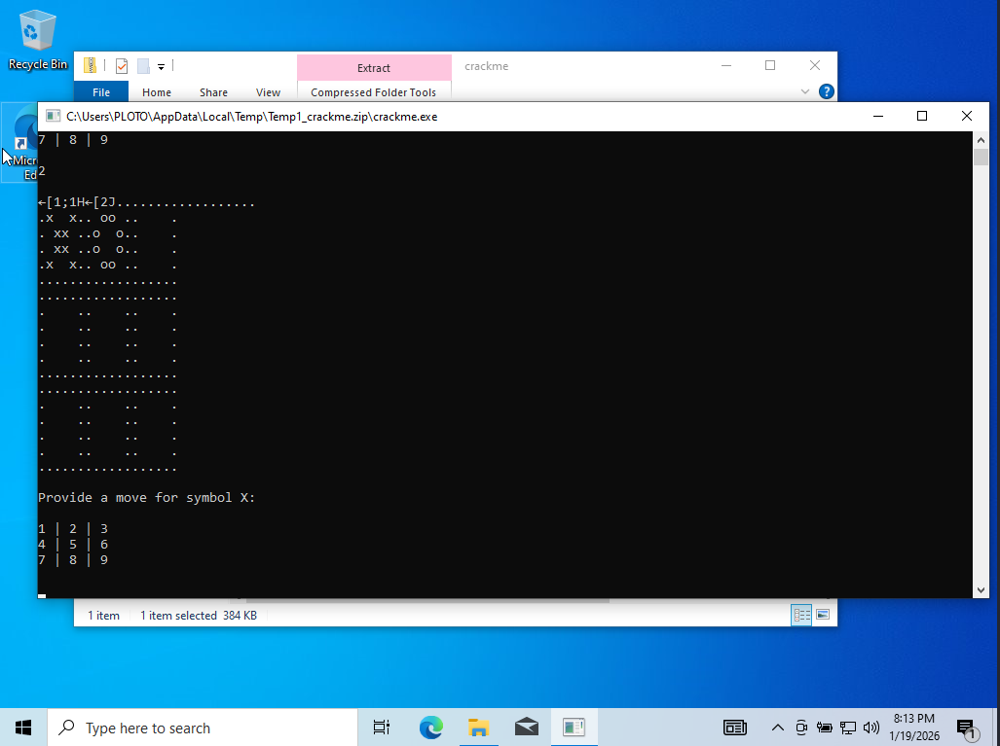
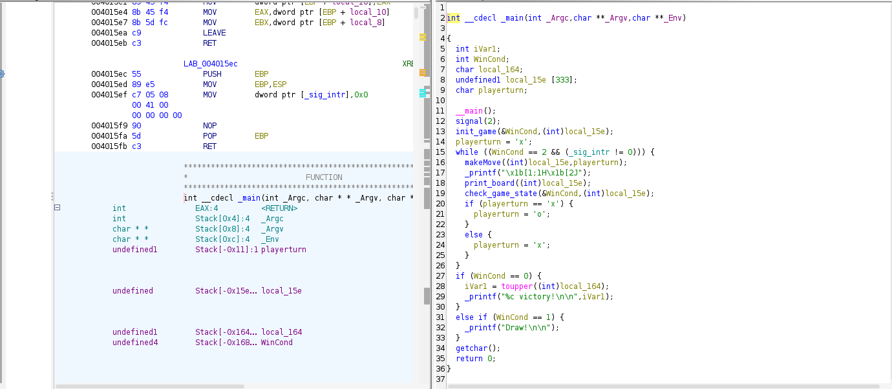
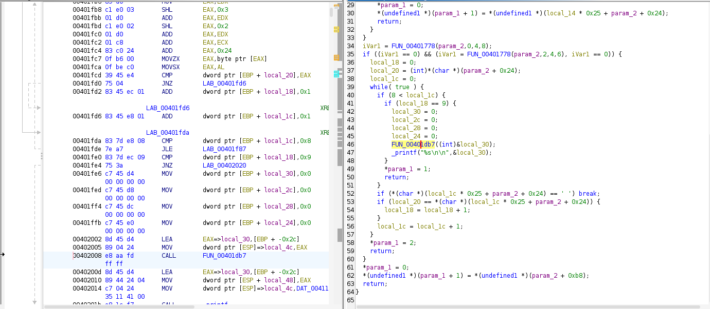
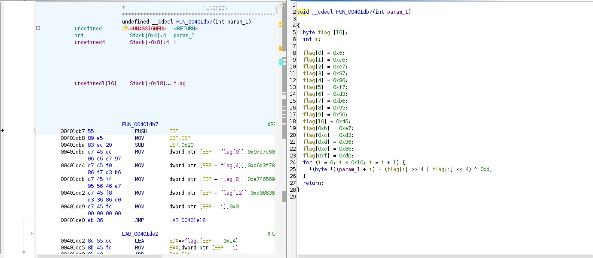
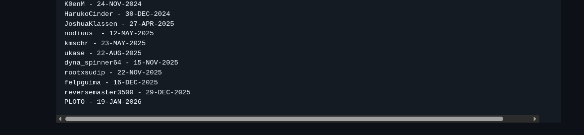

# Crackme

**Challenge:** crackme.exe  
**Type:** PE32 (x86)  
**Source:** [jeFF0Falltrades x86 Tutorial](https://github.com/jeFF0Falltrades/Tutorials/tree/master/master0Fnone_classes/1_x86_Demystified/crackme)  
**Tools:** Ghidra, VS Code  
**Difficulty:** beginner

---

## Challenge Overview

Downloaded and ran the binary. It's a tic-tac-toe game.



Played a few rounds - nothing special happened. Flag must be hardcoded or triggered by specific game state.

---

## Static Analysis

### Initial Reversing

Loaded into Ghidra and checked the main game loop.



Standard game structure:
- Initialize board
- Get player input
- Check win conditions
- Switch turns

Focused on `check_game_state()` since that's where win logic would be.

### Finding the Flag

In `check_game_state()`, found the normal win checking (rows, columns, diagonals), then this:



```c
if (local_18 == 9) {  // All squares filled
    local_30 = 0;
    local_2c = 0;
    local_28 = 0;
    local_24 = 0;
    FUN_00401db7((int)&local_30);
    _printf("%s\n\n", &local_30);
}
```

This executes when all 9 squares are filled. Calls unknown function then prints something.

### The Decryption Function

Examined `FUN_00401db7()`:



Hardcoded encrypted bytes:

```c
local_18[0] = 0x06;
local_18[1] = 0xc6;
local_18[2] = 0xe7;
// ... 13 more bytes
```

Decryption loop:

```c
for (local_8 = 0; local_8 < 0x10; local_8++) {
    *(byte *)(param_1 + local_8) = 
        (local_18[local_8] >> 4 | local_18[local_8] << 4) ^ 0xd;
}
```

Algorithm:
1. Rotate bits
2. XOR with 0x0D

Tried filling all 9 squares in the game - didn't print anything. Had to decrypt manually.

---

## Solution

Wrote a quick decryption script:

```cpp
#include "bits/stdc++.h"
using namespace std;

int main()
{
    int flag[16] = {
        0x6, 0xc6, 0xe7, 0x97, 0x86, 0xf7, 0xd3, 0xb6,
        0x95, 0x56, 0x46, 0xe7, 0xd3, 0x36, 0x86, 0xd0
    };
    
    for (int i = 0; i < 0x10; i++) {
        flag[i] = (flag[i] >> 4 | flag[i] << 4) ^ 0xd;
    }
    
    for (int i = 0; i < 15; i++) {
        cout << char(flag[i]);
    }
    
    return 0;
}
```

**Running the script:**

```bash
$ g++ decrypt.cpp -o decrypt && ./decrypt
master0fThis0ne
```

**Flag:** `master0fThis0ne`

---

## Wall of Fame

Successfully submitted to the challenge's Wall of Fame!



**Link:** [Wall of Fame](https://github.com/jeFF0Falltrades/Tutorials/blob/master/master0Fnone_classes/1_x86_Demystified/crackme/Wall_of_Fame.md)

---

## Summary

Simple crackme with XOR + bit rotation encryption. The flag triggers when the board fills up, but doesn't actually print during gameplay - only way to get it is static analysis and manual decryption.

**Files:**
- [decrypt.cpp](./CrackTheFlag.cpp) - Solution script
- [Screenshots](./screenshots/) - Analysis screenshots